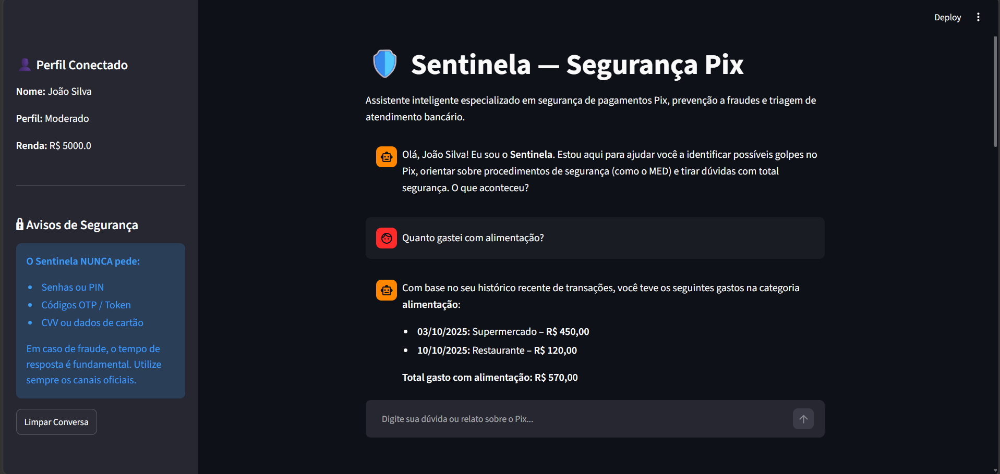

# Pitch (3 minutos)

> [!TIP]
> Print do chat do Sentinela

 
## Roteiro

### 1. O Problema (30 seg)
> Qual dor do cliente você resolve?

O Sentinela resolve um problema crítico: **reduzir o tempo entre a percepção de um possível golpe envolvendo Pix e a adoção das medidas corretas pelo cliente**[cite: 1]. Em situações de fraude, o usuário frequentemente está sob forte estresse, tem dificuldade para distinguir uma transação legítima de um golpe e não sabe qual procedimento seguir, o que é agravado pela urgência exigida pelo Banco Central para acionar o Mecanismo Especial de Devolução (MED)[cite: 1].

### 2. A Solução (1 min)
> Como seu agente resolve esse problema?

O Sentinela atua como uma primeira camada inteligente de atendimento que combina **LLM, dados transacionais autorizados, regras determinísticas e base de conhecimento bancária**[cite: 1]. Ele identifica o problema, avalia o contexto de forma segura (sem permitir alucinações do modelo)[cite: 1], orienta o cliente sobre os próximos passos oficiais — como o uso do MED —, previne novos danos e encaminha o caso para os fluxos formais do banco, comunicando de forma transparente que a recuperação de valores depende de análise e não é garantida[cite: 1].

### 3. Demonstração (1 min)
> Mostre o agente funcionando (pode ser gravação de tela)

[Demonstração da interface em Streamlit rodando localmente]:
1. Exibição da tela de boas-vindas com o cliente autenticado (ex: João Silva).
2. Consulta de transações reais estruturadas (ex: perguntando *"Quanto gastei com alimentação?"* para demonstrar a extração exata de dados).
3. Simulação de um relato de golpe ou transação suspeita via Pix, destacando a resposta calma, objetiva, a recusa segura em solicitar dados sensíveis/senhas e o direcionamento correto para o fluxo de contestação.

### 4. Diferencial e Impacto (30 seg)
> Por que essa solução é inovadora e qual é o impacto dela na sociedade?

O grande diferencial do Sentinela é a sua **arquitetura de segurança em camadas**, que separa a compreensão conversacional da LLM das decisões críticas executadas por motores de regras determinísticos e APIs controladas[cite: 1]. Ele impede alucinações financeiras, protege a privacidade dos dados e bloqueia engenharia social[cite: 1], gerando um enorme impacto social ao acolher usuários sob estresse, acelerar o tempo de reação a fraudes no Pix e reduzir erros humanos em momentos cruciais de segurança bancária[cite: 1].

---

## Checklist do Pitch

- [x] Duração máxima de 3 minutos
- [x] Problema claramente definido
- [x] Solução demonstrada na prática
- [x] Diferencial explicado
- [x] Áudio e vídeo com boa qualidade

> Obs. Uma parte do vídeo foi dedicada a uma **apresentação pessoal** para **contextualização do projeto**. A apresentação do projeto em si está dentro dos **3 min** de duração.
---

## Link do Vídeo

[Assista a uma apresentação rápida do Sentinela]
